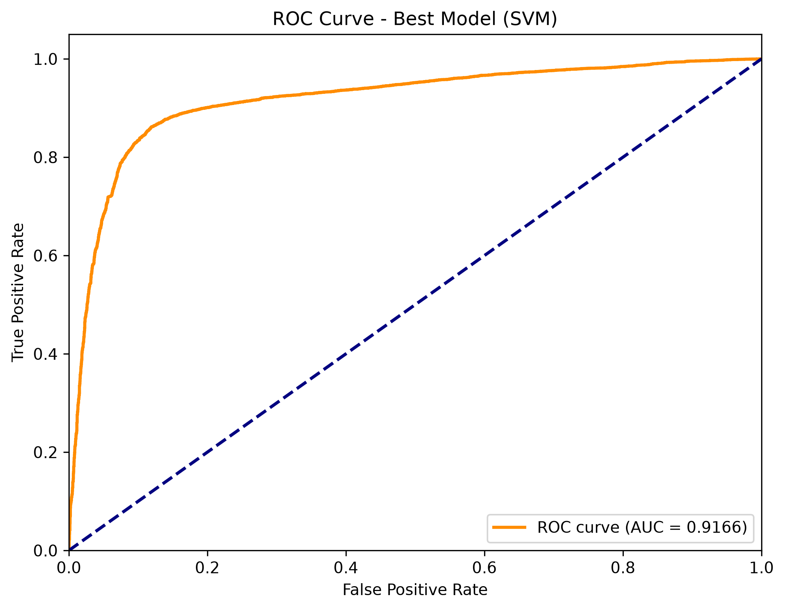

# 🕵️ Fake News Detection System

A Machine Learning based web application that detects whether a news article is **Fake** or **Real** using an SVM classifier.

## ✨ Features

- 🔍 Detects fake vs real news in real-time
- 🎯 SVM model with **91.66% accuracy**
- 🌐 User-friendly Flask web interface
- 📊 Visualizations (ROC curve, Confusion matrix)
- 📱 Responsive UI

## 🛠️ Tech Stack

- **Backend:** Python, Flask
- **ML:** Scikit-learn (SVM), Pandas, NumPy
- **Frontend:** HTML, CSS, JavaScript
- **Visualization:** Matplotlib, Seaborn

## 📁 Project Structure
